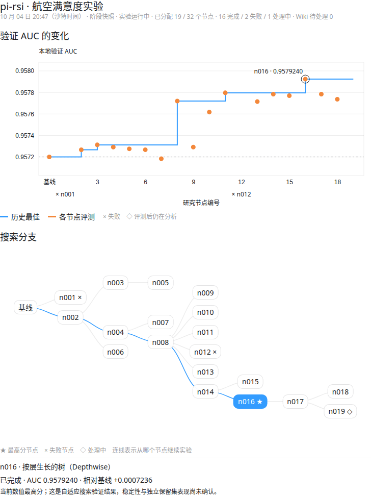

# pi-rsi：围绕编码 Agent 的自动研究框架

[English](README.md) · [简体中文](README.zh-CN.md)

pi-rsi 将任务说明、基线代码和**冻结评测器**组织成任务包，通过假设搜索树安排实验。每个研究节点在独立 Git worktree 中实现一个假设，交付代码、结果交接和后续提案，再由框架执行正式评测及审计。长期研究记录保存在文件中，支持停止后从原实验目录恢复。

当前为 v0.1 研究原型，主要在一台 Linux 工作站上验证，使用 Grok CLI 或固定版本 pi 0.85.1。项目使用 MIT 许可证。[实验文章](https://blog.pocketplay.win/rsi/)。

## 真实实验：航空满意度

仓库包含一轮 RTX 2080 Ti 航空满意度研究的阶段归档：离线可视化、完整搜索树、各节点聚合指标、原始基线和当前最佳方案的源码。当前最佳验证 AUC 为 **0.9579240131**，基线为 **0.9572004066**；稳定提升尚未经过独立重复验证，最终保留集仍封存。

- [中文实验 README](examples/airline-s6e10-2080ti-20261004/README.zh-CN.md)
- [English experiment README](examples/airline-s6e10-2080ti-20261004/README.md)
- [离线可视化](examples/airline-s6e10-2080ti-20261004/index.html)
- [完整搜索树](examples/airline-s6e10-2080ti-20261004/tree.html)
- [研究 Wiki：知识、证据和版本变化](examples/airline-s6e10-2080ti-20261004/wiki.html)

博客交互入口：[实验概览](https://blog.pocketplay.win/rsi/interactive/airline-20261004/zh/)、[完整搜索树](https://blog.pocketplay.win/rsi/interactive/airline-20261004/zh/tree/)、[研究 Wiki](https://blog.pocketplay.win/rsi/interactive/airline-20261004/zh/wiki/)。



下载仓库后直接用浏览器打开页面即可，无需 GPU 或登录。归档不是完整断点，不能直接继续原实验；顺序研究和 Wiki 的原始运行来自当前开发版框架，其说明及复现边界写在实验 README 中。

## 安装

环境要求：Linux、Python 3.11 或更新版本、Git，以及 `uv` 或 `pip`。pi 运行器还需要 Node 22。研究 Agent 的运行环境和模型认证需单独准备。

```sh
uv tool install git+https://github.com/xiehuanyi/pi-rsi
rsi task list
rsi task install kaggriculture
```

也可以用 `pipx install git+https://github.com/xiehuanyi/pi-rsi`。私有仓库需要相应 Git 访问权限。

安装后的实验默认位于 `~/.pi-rsi/experiments/`，可通过 `RSI_HOME` 指定根目录。从 Git checkout 使用 `./rsi` 时，使用仓库内的任务包和 `experiments/`；执行 `npm install --ignore-scripts` 安装固定版本 pi。

## 开始一个实验

下面是仓库现有任务包的使用示例；运行前需要完成所选 Agent 的认证和任务包环境准备。

```sh
rsi init demo --task kaggriculture --runner grok --model grok-4.6 --effort high \
  --utility-model grok-4.5 --utility-effort low \
  --width-root 3 --width 2 --depth 4 --max-nodes 10 --parallel 2
rsi run demo
rsi status demo
```

`rsi run demo` 对已有实验执行恢复流程；原实验目录中的代码、工作树和记录需要保留。`scripts/supervise.sh` 可用于从外部监控实验进程。

| 命令 | 用途 |
|---|---|
| `rsi task list / install` | 查看或安装任务包 |
| `rsi init` | 创建实验目录和配置 |
| `rsi run` | 运行或恢复实验 |
| `rsi status` | 查看节点状态和分数 |
| `rsi render` | 重建搜索树页面和文字报告 |
| `rsi eval` | 调用任务包的冻结评测器 |
| `rsi ops` | 处理环境或评测器问题 |
| `rsi relabel` | 根据分数比较重新计算节点分类 |
| `rsi write` | 为已结束的实验生成说明 |

准确参数以对应版本的 `rsi <命令> --help` 为准。

## 搜索与评测

框架先评测未修改的基线，再生成多种初始假设。默认树调度器从分数较好、仍可扩展的节点选择下一次实验；当前分支用尽后会回退到其他分支。宽度、深度、节点数量、连续无提升次数、目标分数及运行时间共同限制搜索。

研究 Agent 只能修改候选代码。它可以用任务包暴露的快速评测进行开发；正式指标由框架使用冻结评测器计算。修改受保护的评测器或文档会使节点失败。崩溃、超时和评测失败会进入诊断与限次重试流程；预算耗尽时会尝试抢救交接文档。

分数提升、启发式 `improved/no_change` 分类和统计证据是不同层次的记录。尤其是反复用于选方案的验证集，不能替代独立保留集确认；航空实验 README 明确记录了这些限制。

## 每个节点留下什么

| 文件 | 内容 |
|---|---|
| `HYPOTHESIS.md` | 该节点的假设与目标 |
| `PROGRESS.md` | 过程记录及开发结果 |
| `HANDOFF.md` | 实现、结果与限制的交接 |
| `proposals.json` | 后续实验提案 |
| `eval/metrics.validation.json` | 框架正式评测指标 |
| `SUMMARY.md` | 审计摘要和节点分类 |
| `FAILURE.md` | 失败原因与诊断 |
| `runner.prompt.md`、`runner.jsonl` | 原始提示词和运行事件 |

实验级记录包括 `tree.json`、`tree.html`、`INSIGHTS.md`、`DEADENDS.md`、`events.jsonl`、`costs.json` 和 `REPORT.md`。搜索树页面是渲染快照，更新后需要刷新。原始运行记录适合本地排查；本仓库的航空示例另做了聚合导出。

## 运行器和任务包

- `grok`：使用已认证的官方 Grok CLI，无界面运行。
- `pi`：使用固定版本 pi 的 JSON 模式，模型标识为 `provider/model`。
- `script`：测试用替代运行器，不需要真实模型调用。

实现 Agent 和辅助 Agent 可以在 `rsi.toml` 的 `[runner]`、`[utility]` 中分别配置。

任务包位于 `pi_rsi/tasks/`；checkout 中 `tasks` 是入口链接。`task.toml` 定义说明、基线、文档、评测命令及评测种子集。任务自己的数据准备、依赖和硬件限制由对应任务包说明。航空示例的任务包附有固定数据清单和 GPU 校验，不分发原始 CSV 或保留集标签。

## 主要目录

| 路径 | 用途 |
|---|---|
| `rsi`、`pi_rsi/cli.py` | 命令入口 |
| `pi_rsi/orchestrator.py`、`scheduler.py` | 实验流程与搜索调度 |
| `pi_rsi/worker.py`、`agents.py` | 实现、规划、审计与诊断 |
| `pi_rsi/runner/` | Agent 运行器 |
| `pi_rsi/evaluator.py` | 冻结评测调用 |
| `pi_rsi/render.py`、`templates/` | 报告与可视化 |
| `pi_rsi/tasks/` | 随仓库提供的任务包 |
| `examples/` | 可查看的真实实验归档 |
| `scripts/export_airline_example.py` | 更新航空实验的阶段归档 |
| `experiments/` | 本地运行状态，默认不进入 Git |

## 验证

原有框架提供 `tests/test_loop.sh` 和 `tests/test_pi_runner.sh`，分别检查模拟 Agent 的实验流程和本地模拟服务下的 pi 运行器。

本次航空归档另外验证了：离线打开两种浏览器、节点选择、分数图例切换、窄屏布局、README 链接、有效分数台账，以及导出源码与实验 Git 提交的一致性。没有为导出而重新运行训练或解封最终保留集。
