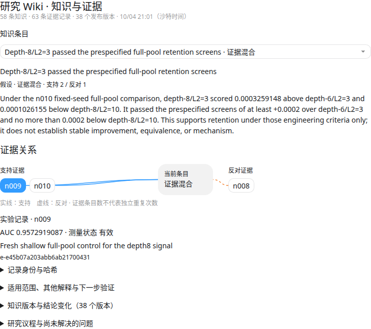

# 航空满意度：一次真实的 pi-rsi 实验

[English](README.md) · [简洁可视化](index.html) · [完整搜索树](tree.html) · [研究 Wiki](wiki.html) · [快照摘要](SUMMARY.json)

这是在用户提供的 S6E10 航空满意度数据上，用一张 RTX 2080 Ti 完成的真实顺序研究实验。GPT-6.1 Sol 负责研究规划、实现和结果分析；GPT-6 Luna 负责研究 Wiki、审计和故障诊断。

**本目录是仍在运行的实验阶段快照，不是已经完成的 32 节点报告。** 准确的快照时间、节点数量和分数见 [SUMMARY.json](SUMMARY.json)。首次导出时已分配 19 个节点：16 个完成、2 个失败、1 个正在运行；当前上限为 32 个研究节点，不含原始基线。

## 打开可视化

也可直接访问博客上的[实验概览](https://blog.pocketplay.win/rsi/interactive/airline-20261004/zh/)、[完整搜索树](https://blog.pocketplay.win/rsi/interactive/airline-20261004/zh/tree/)、[研究 Wiki](https://blog.pocketplay.win/rsi/interactive/airline-20261004/zh/wiki/)；配套有[中文文章](https://blog.pocketplay.win/zh/blog/pi-rsi-airline-20261004/)和[英文版本](https://blog.pocketplay.win/en/blog/pi-rsi-airline-20261004/)。

下载或克隆仓库后，用浏览器直接打开 `index.html`。分数曲线、搜索分支、节点详情和 D3 均已包含在页面内，可以离线使用。点击节点查看详情，点击图例显示或隐藏分数系列。`tree.html` 是完整浏览器，包含假设、交接文档、结果分析、审计、失败记录和研究知识，同样可以离线打开。GitHub 文件页显示的是 HTML 源码，不会执行交互页面。

也可以在仓库根目录运行：

```sh
python3 -m http.server 8000 --directory examples/airline-s6e10-2080ti-20261004
```

然后打开 `http://localhost:8000/`。两个页面都是归档快照，不会自动读取原机器的新进度。


## 已记录的结果

| 节点 | 实验变化 | 搜索验证集 ROC-AUC |
|---|---|---:|
| root | 原始 GPU CatBoost 基线 | 0.9572004066 |
| n008 | 树深 8，加大 L2 正则化 | 0.9577204389 |
| n011 | 数值评分同时加入类别表示 | 0.9577967297 |
| **n016** | **原始特征，按层生长的树（Depthwise）** | **0.9579240131** |
| n017 | 重新评测原始特征的对称树对照 | 0.9577845706 |
| n018 | 将对称树深度提高到 10 | 0.9577366851 |

n016 是本快照中已完成且有效的最高分，比基线高 **0.0007236065**。但相对 n014 仅高 **0.0001394425**，未达到预设的 0.0002 实用提升标准；它在 quick 集上的差值还是负的。这些分数来自被反复用于选择方案的搜索验证集，GPU 训练波动未知，也没有确立独立重复验证。数值最高不能直接证明稳定优于其他方案、统计显著性或因果机制。

n001 的模型文件在评测后发生变化，完整性校验失败，因此分数不能进入最佳曲线。n012 超出实现／开发尝试预算；后续 n013 完成了技术修复，但没有超过当前最佳。失败结果保留展示。最终保留集仍封存，也没有向 Kaggle 提交。

## 目录内容

| 文件或目录 | 用途 |
|---|---|
| `index.html` | 可直接打开的分数曲线与可点击搜索分支 |
| `tree.html` | 完整实验浏览器 |
| `wiki.html`、`wiki-data.json` | 离线知识／证据浏览器和已发布知识版本历史 |
| `SUMMARY.json`、`results.json`、`snapshot.json` | 阶段状态、分数台账与浏览器数据 |
| `metrics/` | 各节点聚合指标及测量有效性标记 |
| `models/root/`、`models/n016/` | 基线和当前最佳方案在实验 Git 提交中的原始源码，附来源记录 |
| `rsi.toml` | 使用仓库相对任务路径的实验配置归档 |
| `assets/` | 离线页面导出模板和 D3 许可证 |
| `../../pi_rsi/tasks/airline-s6e10-2080ti/` | 原任务说明、数据准备代码、基线、冻结评测器、公开清单和固定依赖版本 |

归档不包含数据行、保留集标签、逐行预测、模型权重、原始模型会话日志、认证信息或机器绝对路径。配置和指标哈希用于记录这轮实验；此目录不能直接作为 `rsi run` 的断点继续运行。原实验目录仍单独保留完整恢复状态。

## 数据、资源和复现

冻结分层切分使用种子 **20261004**：训练池 489,744 行、搜索验证集 104,945 行、最终保留集 104,946 行。quick 使用训练池内互不重叠的 50,000 行训练数据和 10,000 行开发数据。整次候选程序的时间上限分别为 quick 60 秒、validation 180 秒、final 240 秒；CPU 预处理最多八线程，每个研究节点最多三次开发尝试。

任务包读取放在其 `data/raw/` 下的三个原始、已提供 CSV。`setup.sh` 使用本地缓存离线安装固定版本依赖，然后运行 `prepare.py`；已有切分只校验，不会静默重建。本仓库不分发 CSV。详见任务包的[数据说明](../../pi_rsi/tasks/airline-s6e10-2080ti/docs/DATA.md)和[冻结协议](../../pi_rsi/tasks/airline-s6e10-2080ti/docs/PROTOCOL.md)。

原评测器和候选代码会严格检查这轮实验使用的 RTX 2080 Ti 身份及可见设备掩码。查看归档无需 GPU；实际运行候选需要原有数据、环境和已授权 GPU。迁移到其他 GPU 或切分属于新协议，应单独报告。在原工作站上，可从仓库根目录运行最佳候选的 quick 开发评测：

```sh
export CUDA_DEVICE_ORDER=PCI_BUS_ID
export CUDA_VISIBLE_DEVICES=GPU-2c54fc50-8962-5ef4-a42f-45752aedef9d
pi_rsi/tasks/airline-s6e10-2080ti/.venv/bin/python \
  pi_rsi/tasks/airline-s6e10-2080ti/eval/eval.py \
  --agent-dir examples/airline-s6e10-2080ti-20261004/models/n016 \
  --seedset quick --out /tmp/airline-n016-quick.json \
  --python pi_rsi/tasks/airline-s6e10-2080ti/.venv/bin/python
```

这条命令是复现说明，导出本示例不会执行评测。正式验证只能由框架执行，final 默认关闭。GPU CatBoost 不保证逐位确定性，因此重新训练不保证分数完全相等。

## 更新归档

在有原实验目录和当前开发版框架的工作站上，先更新原生浏览器，再导出：

```sh
./rsi render airline-s6e10-sol61-2080ti-20261004
python3 scripts/export_airline_example.py \
  --experiment experiments/airline-s6e10-sol61-2080ti-20261004
```

导出工具仅使用 Python 标准库，读取聚合结果和已提交源码，将归档写在原实验目录之外。它不启动研究 Agent、任务或评测；会去掉机器绝对路径和原始执行记录，保留失败节点，并在续跑期间排除上一轮 pilot 遗留的 `final.json`。导出源码包括基线及当时有效、已完成的最佳候选。刷新后请同步更新本说明和预览图。

## 浏览研究 Wiki



离线打开 `wiki.html`。选择观察、假设或经验条目，可查看陈述、已记录的状态、适用范围、其他解释及下一步验证。支持和反对证据分别展示；点击证据可看实验聚合指标或原始文档网址，以及不可变记录的哈希。展开版本历史，可看真实的前后状态和当时记录的修订原因；研究议程保留未解决问题和区分性实验。

Wiki 状态是模型在特定范围内整理的判断，不等于独立验证的事实。文档条目“获支持”不等于实验确认，多个证据记录也可能来自同一个实验或来源。页面导出来源元数据，不导出完整原始证据包或私有数据。Wiki 页面有自己的版本时间；单独刷新时可以比实验快照更新。

不调用 LLM 或评测，只导出最新已发布 Wiki：

```sh
python3 scripts/export_wiki_view.py \
  --memory experiments/_memory/airline-s6e10-2080ti/protocols/3809e829ce612de2b66a
```

使用 `--revision <版本 ID>` 固定历史版本。实验导出工具会将 Wiki 固定到完整搜索树内记录的版本；独立 Wiki 导出工具默认读取 `CURRENT.json`。导出前会检查所有知识引用是否存在于证据索引，历史按已发布版本的前驱关系排列，不会把被拒绝的模型草稿当成新版本。

本轮顺序研究／Wiki 流程来自当前开发版框架。本次仓库更新只加入实验归档和任务包，不会混入其他待整理的框架改动；候选 CLI 和冻结评测器均已单独提供。

项目代码使用 MIT 许可证；内嵌 D3 7.9.0 使用 [ISC 许可证](assets/D3-LICENSE.txt)。

## 发布交互页面

博客构建沿用 PocketPlay Kit v2，将脚本和数据作为同站资源加载，不放宽博客脚本策略，也不在文章 Markdown 中嵌入可执行 HTML。用本目录的聚合归档生成中英文六个页面：

```sh
python3 scripts/build_blog_visualizations.py \
  --output work/blog-preview/rsi/interactive/airline-20261004 \
  --kit /path/to/pocketplay-platform/kit/v2
```

`scripts/deploy_blog_visualizations.py` 在既有 `pocket` 容器中只安装本静态组件：创建不可变版本，原子切换固定路径的链接，保留私有回滚记录，并在 robots.txt 声明六页站点地图。它不替换平台或旧博客版本，不修改 Nginx 路由、不操作账号，也不调用 LLM。`blog/` 中的文章 JSON 经现有限定发布器发布。要更新快照，先刷新归档，再重新构建；没有自动轮询或新增定时任务。

发布核验：六个线上页面返回 200，节点、证据与历史版本等主要交互均通过；390px、1440px 和明暗主题布局检查通过。浏览器可读取公开数据及站点地图，代表性线上脚本与构建内容一致；中英文章 canonical、入口、RSS 和文章站点地图已核对。研究站点地图通过 robots 声明进入共享总索引。现有 CSP 会拦截 Cloudflare 注入的统计脚本，旧页和新页均有这一提示，不影响本页面交互；本记录不表示 Google 已收录。
